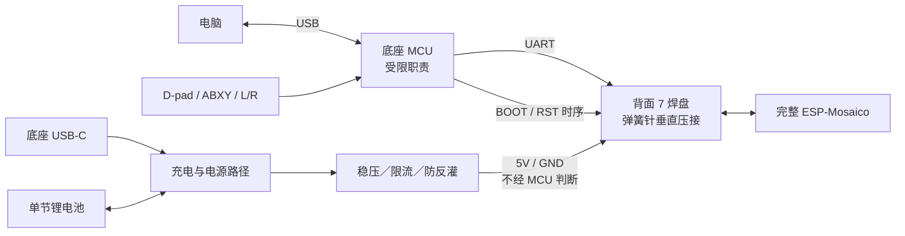

# mosaico keyboard

基于 ESP-Mosaico 的手持 Vibe Coding 终端。

GitHub 仓库：[ChromeTokyo/MosaicoKeyboard](https://github.com/ChromeTokyo/MosaicoKeyboard)。

以完整、可拆卸的 ESP-Mosaico 为核心，设计一块集成实体输入与电池管理的底座 PCB，以及配套掌机外壳。复杂的计算、屏幕、触摸、音频、无线与传感器功能沿用 Mosaico。

**当前阶段：需求基线与 A0 硬件草案。现有设计文件不能用于生产。**

> **重要：实际出货硬件为 BaseBoard V1.2（日期码 260821），而官方公开资料只有 V1.0（260710）。两版背面不同——V1.0 的四个背部扩展焊盘 `SDA`／`+`／`−`／`SCL` 在 V1.2 上已取消，背面改为 7 个焊盘 `GND BOOT RST RX TX 5V GND`。** 详见 [硬件版本差异](review/claude/hardware-revision/README.md)。本文中凡涉及「四个背部触点」的表述均属 V1.0 遗留，已逐条标注。当前已定方向为[方案 H](review/claude/option-h-pogo-uart-mcu.md)。

分工：Claude Fable 负责主控、产品视觉与后期交互；Chrome GPT-6 负责电路、PCB 和外壳结构；Hiro GPT-6 分批独立复核。Cursor／Grok 仅作可选辅助。按质量节点推进，允许延长工期。

## 目标

- 做成长条手持设备：中间横置 Mosaico，左侧 D-pad，右侧 ABXY，两侧有浅握把。
- Mosaico 保持完整，不改主板、不焊线，能够从底座拆下。
- 底座以弹簧针垂直压接 Mosaico 背面焊盘连接。**（V1.0 原为四个背部触点承载 I²C、供电与地；V1.2 取消该四触点，现按背面 7 焊盘 `GND BOOT RST RX TX 5V GND` 走供电与 UART，见方案 H。）**
- **底座允许使用一颗受限职责的可编程 MCU**（2026-09-20 用户修订，原为「不使用第二颗可编程 MCU，通过 I²C IO 扩展器读取按键」）。原约束的前提是背部四触点提供 I²C，而实际出货的 BaseBoard V1.2 已取消该四触点，背面只剩 UART，走 UART 必须有一端能组帧。职责边界与失效安全要求见 `docs/PROJECT_PLAN.md` R04。
- 使用国内嘉立创／嘉立创 EDA 流程，尽量由工厂完成 PCB 制造和器件焊接。
- 完成可编辑工程、经过检查的制造文件、BOM、装配说明与硬件验收记录。

## 第一版范围

| 部分 | 第一版要求 |
| --- | --- |
| 核心模块 | 完整 ESP-Mosaico，保留原有屏幕、触摸、音频、无线、传感器和原生 USB-C |
| 实体输入 | D-pad 四方向、ABXY、L/R；Mode 暂预留，是否装配在布局冻结前确定 |
| 输入电路 | **已改（V1.2）**：由底座 MCU 直接扫描按键并经 UART 上报。原 I²C IO 扩展器方案的前提（背部四触点提供 I²C）已不存在。MCU 职责边界与失效安全见 `docs/PROJECT_PLAN.md` R04 |
| 按键结构 | 低矮贴片 tact switch，3D 打印十字帽及独立键帽；十字帽有中央支点与限位 |
| 连接 | **已改（V1.2）**：弹簧针垂直压接背面 7 焊盘 `GND BOOT RST RX TX 5V GND`。焊盘间距、尺寸与表面形态官方未给，须实测（H-03）。不使用左右 H1/H2 盲插；两个模块槽保持空出，一个可给摄像头 |
| 电池 | 目标 1000–2000 mAh 薄型单节锂电池，具体型号、尺寸、接口和温度检测待选型 |
| 供电 | 底座自带 USB-C 充电与电源管理，经背面 `5V` 焊盘给 Mosaico 供电。**该焊盘的载流能力官方无任何标注（H-02），未核实前不得确定电源拓扑** |
| 结构 | 从上方落入槽位，由导向、定位和可拆上压框固定；壳体承担装配与按压载荷 |
| 原生功能 | 保留扬声器、麦克风、AI Key、USB-C、BOOT、充电指示与电源开关的使用通路。方案 H 走背面，不占用左右两侧与上下边，原生 USB-C 通路不受影响 |
| 生产 | 优先选择工厂可采购、可贴装器件；电池插接、键帽与外壳装配另列工序 |

低频功能放在触摸 UI 中。第一版不做大型模拟摇杆、硅胶导电胶键盘、核心板改版或应用固件。

## 架构

**失效安全：供电路径不经过 MCU 的软件判断——MCU 死机、固件损坏或未烧录时，Mosaico 仍须能正常工作。**

电源器件、容量、UART 协议与机械尺寸均以审核后的工程为准；以上是功能架构，不是已完成的电路。`RX`／`TX` 是否为 UART0、是否被日志占用尚未核实（H-01）。

## 工作顺序与现状

先锁定接口和空间约束，再完成原理图、PCB 与外壳详细设计。接口资料核对、电路设计、供应链调查可以并行；PCB 最终布局依赖接口与关键器件冻结。

| 节点 | 工作 | 完成条件 | 当前状态 |
| --- | --- | --- | --- |
| M0 | 需求与仓库基线 | 需求、范围、交付物、问题清单和协作规则入库 | 仓库已创建，初始文档与 A0 草案入库 |
| M1 | 模块接口与机械约束 | **背面 7 焊盘**的引脚、坐标、尺寸、朝向、压缩高度，以及模块与开孔包络可追溯 | 官方只有 V1.0 资料且不含机械图；V1.2 背面焊盘的全部几何待实测 |
| M2 | 原理图与器件选型 | 电源、按键、**底座 MCU 与 UART**、保护完整；引脚／封装核对；ERC 与计算审核通过 | A0 草案按 V1.0 四触点＋I²C 扩展器设计，**架构已变更，需重做**；且 A0 自身有三个未修复的阻断项 |
| M3 | PCB 设计与工厂审核 | 完成布局布线、DRC、封装核对、供应与贴装能力确认 | 仅布局研究，未完成布线 |
| M4 | 外壳与装配设计 | PCB／模块／电池三维干涉检查，按键与 Pogo 行程核对，结构样件装配通过 | 待接口与 PCB 协同推进 |
| M5 | 首版打样 | 制造包审核、报价与数量确认，完成 PCB／PCBA 和结构样件 | 未开始 |
| M6 | 硬件验收与修订 | 供电、充电、双 USB 场景、**UART 通信**、按键、接触可靠性及装配验证通过；**另须验证失效安全**（MCU 未烧录与人为停机两种状态下 Mosaico 仍可用） | 未开始 |
| M7 | 应用固件与电脑通信 | 在稳定硬件上实现 UI、语音、任务与 Agent 控制等 | 按要求最后处理 |

**“主板搞定”的判定：M2、M3 通过，且 M6 实物验证通过。只有图纸或 Gerber 文件不代表硬件已完成。**

## 仓库导航

- [团队分工与放行规则：Claude 主控](docs/TEAM_PLAN.md)
- [首批工作队列与负责人](docs/TASK_BOARD.md)
- [Claude 接管入口](CLAUDE.md)
- [需求、验收与工作计划](docs/PROJECT_PLAN.md)
- [当前设计状态与待解决问题](docs/DESIGN_STATUS.md)
- [Agent 协作规则](AGENTS.md)
- `design/`：现有 A0 生成脚本、原理图草案、布局研究及审核表。
- `references/`：已收集的参考资料与器件库缓存；不代表所有器件已选用。
- `review/`：后续电气、机械、生产与实物验收记录。

用户已购入 ESP-Mosaico 影像套装（含交互控制模块与摄像头模块），预计 2026-09 下旬送达日本用户本人手中。在此之前按官方资料推进；**但官方资料只覆盖 V1.0，与实际出货的 V1.2 存在已确认的差异**，资料缺失处保留明确的待确认项，不把推测尺寸用于正式生产。

国内不设实物验收执行人，整机验收改在日本由用户执行，对应质量节点 G6；相应的远程验收补偿约束见 [团队分工与放行规则](docs/TEAM_PLAN.md) 第 6 节。
