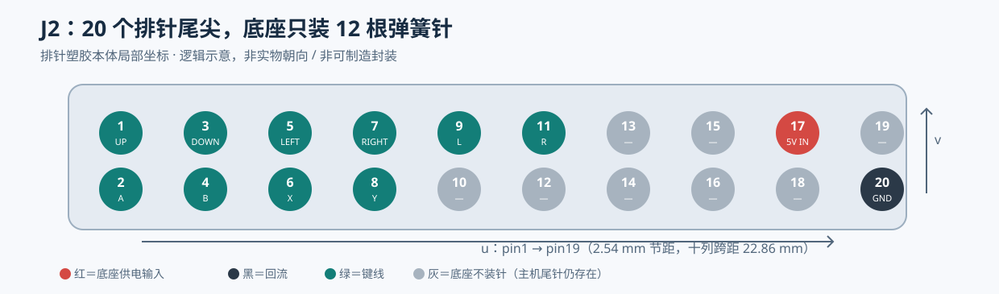

# C24-03：新 J2 逻辑阵列与局部坐标（未冻结封装）

**方案：2×10 个排针尾尖全部存在，底座只装 12 根弹簧针。** 10 根键线 + H2 pin17 `5V_IN` + pin20 `GND`；不装 SDA/SCL/3V3/USB/5V_OUT/EEPROM 地址线。此处 J2 是底座接触接口的**逻辑名称**，不再是旧 4×4 焊盘、2×8 弹簧针或转接板 J3。完整逐位表见 [`j2_logical_matrix.csv`](j2_logical_matrix.csv)。



## 坐标口径

以拟采购的 CJT `A2541WR-2x10P` **排针塑胶本体长轴/短轴的名义中心**为原点；`u` 沿 pin1→pin19 的十列方向，`v` 从奇数行指向偶数行。排针朝 −Z 的尾尖中心名义位置为

```
k = floor((H2_pin − 1)/2)          # 0…9
u = (k − 4.5) × 2.54 mm           # −11.43…+11.43 mm
v = −1.27 mm (奇数 pin) 或 +1.27 mm (偶数 pin)
```

这是**排针本体局部平面坐标**，用于逻辑审查和初版布置。原厂图 p15 给 2.54±0.05 mm 名义网格、2×10 的塑胶长 `B=25.40±0.25 mm`、宽 `5.08±0.25 mm`，故名义中心距端面边缘 `1.27 mm`；不能把名义相减当装配最差公差。原厂图给弯尾露出 `E=3.00±0.20 mm`，但未给两排尾尖独立共面度。真实阵列中心到 H2、外壳和底座主板原点的三维变换仍未知，**此表不是可下单的 XY/Z 封装**。针体孔径、焊盘、占位和 Z 高必须等 C24-02 选型。

对面视图有镜像：**从 Mosaico 下方仰视尾尖**与**从底座上方俯视弹簧针**是面对面图；仅把两张图的长边摆平后照抄左右坐标会镜像。先断电用 pin20 到已知地的导通、pin1 标记/逐针通断，锁实机的奇偶排及长轴正向；再用一个有 pin1/17/20 标记的透明定位片把尾尖投影到底座。EDA 顶视图只能通过实物核对后的刚体+镜像变换生成，不能凭旧 V1.0 文档照片填绝对 X/Y。

## 装针选择

| pin 列 | 奇数行（v=−1.27） | 偶数行（v=+1.27） |
| --- | --- | --- |
| 1 | 1 `KEY_UP` | 2 `KEY_A` |
| 2 | 3 `KEY_DOWN` | 4 `KEY_B` |
| 3 | 5 `KEY_LEFT` | 6 `KEY_X` |
| 4 | 7 `KEY_RIGHT` | 8 `KEY_Y` |
| 5 | 9 `KEY_L` | 10 **空：EEPROM A0/GPIO14** |
| 6 | 11 `KEY_R` | 12 **空：备用 GPIO4** |
| 7 | 13 **空：USB D−** | 14 **空：SCL** |
| 8 | 15 **空：USB D+** | 16 **空：SDA** |
| 9 | 17 **5V_IN** | 18 **空：5V_OUT** |
| 10 | 19 **空：3V3** | 20 **GND** |

键名与 GPIO 按 [`dock_handle_pinmap.h`](../../../firmware/dock_handle/include/dock_handle_pinmap.h) 和 [D1 左槽表](../D1-module-interface/LEFT_SLOT.md) 的现有提案；此处只复用逻辑映射，不表示固件在无 EEPROM 时能原样工作。`pin17` 接底座**经过独立反灌阻断与限流**的输出，`pin20` 是唯一回流针；二者单针电流能力和接触顺序未知。`pin18` 即使底座未装针，主机侧排针尾仍**裸露**，需要外壳遮蔽与错位分析。

## 下单前的强制错位闸门

派工的“0.77 mm 不会桥接 / 3.9 倍安全”仅对定向方针端面、Ø0.9 圆头、纯平移的局部平面模型成立；并不能证明整个装配。若允许 0.64 mm 方针端面任意平面角，圆头与方针的保守单侧触碰半径是 `D/2 + a/√2 = 0.9025 mm`；名义错针首次可能接触位移降至 `2.54−0.9025 = 1.6375 mm`。旧 `±0.45 mm` 不是新 −Z 整体公差，**没有已证明的倍数**。只有实测最大导电头直径 `Dmax`、方针最大边长 `amax`、最小节距 `pmin` 满足 `Dmax + amax√2 < pmin`，且排除弯脚/针筒侧碰，才可声明单头在静态平面不同时压两针。

更危险的路径是**一根针压错一根针**：底座 5V 可落到 H2 pin19/15/18 等；底座 GND 可落到 5V_OUT/3V3；空位不会移除主机侧其余 8 根排针。新版闸门须按 12×20 全表枚举可达平移、旋转、倾斜、未落座/退出、单针漏接及主机/底座供电状态。平面测试可用圆到旋转方形距离构建潜在接触边；只通过平面测试仍需断电样件验证侧碰、时序和接触电阻。**在此之前底座 5V 默认失能，整机不带电压接。**

此表可供 Claude 做外壳定位片，不能作为 G3/G5 硬件放行或 Hiro/Grok 的独立审查结论。
