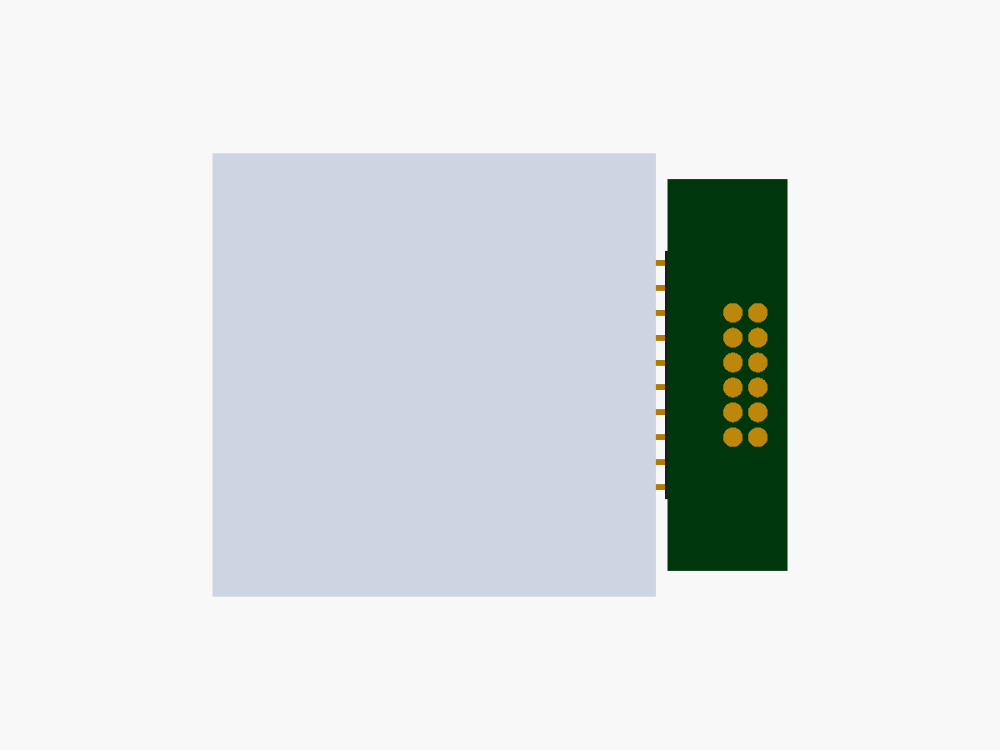
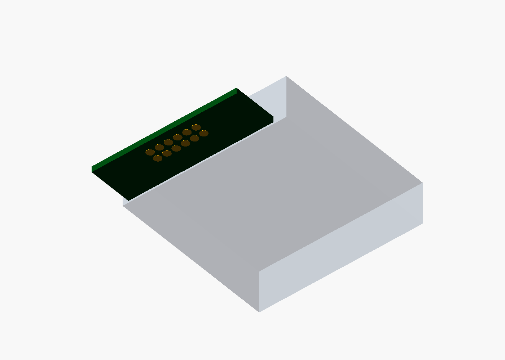

# 用户提出的长边底面单板压入方案（待复核）

**状态：非冻结的替代提案。** 这份材料仅修正旧方案的方向前提并比较触点数量，不是连接器选型、可制造 PCB、整机配合验证或硬件放行。用户 2026-09-23 的标注图指出：触点应在左侧长条转接板**朝底座的整块底面**，Mosaico 连同转接板沿屏面法向整体压入底座；图上的短垂直触点板被明确划掉。

## 朝向纠偏

以屏朝用户、左槽在左的整机坐标：+X 向右、+Y 向上、+Z 从屏面指向用户。

| | 原两板 L／T 形提案 | 本文单板候选 |
| --- | --- | --- |
| 模块板 | 槽板在 YZ、触点板在 XZ，以 J3 转向 | 一块 XY 平板，沿 Mosaico 左侧长边 |
| 主机入座方向 | −Y | **−Z，沿屏面法向压入** |
| 转接板与 H2 | 直插或转向后配合 | 右角 2×10 插头，针轴 +X；真实 V1.2 插座配合未验证 |
| 触点面／底座弹簧针 | 法向 −Y／针向 +Y | **同一块板的背面 −Z／针向 +Z** |
| 板间接头 J3 | 必需 | 不存在 |

旧版 [PINMAP §5.1](https://github.com/ChromeTokyo/MosaicoKeyboard/blob/94e393c55328cedca387affc7dd21aa316603b9c/hardware/module-board/PINMAP.md#L212-L216) 的「纯单板不可实现」证明，前提之一正是触点面法向 −Y。改为 −Z 后，XY 板自身就有面朝底座，原证明不再适用。旧机械模型约 26 mm 的 X 向宽度还受 J3 约束；取消 J3 后应重新核算 D-pad／握把间隙，不能照搬旧干涉结论，也不能反过来宣称新板已通过干涉检查。

```
屏面／用户侧 (+Z)
┌──────────────── Mosaico ────────────────┐
│ 左槽 ← 右角插头 ── 单块 XY 转接板         │
└─────────────────────────── 金属触点(−Z) ┘
                         ↓ 整机压入 (−Z)
                   ↑ 底座弹簧针 (+Z)
                   底座板及握把
```

以下两图是 **12 触点的方向示意**。浅蓝方块只是 Mosaico 假设外形，绿色为转接板，金色圆为板背面的占位触点；图中没有真实连接器、外壳、紧固件和导线。**图示满布 2×6 在沿用旧版焊盘／针头参数时不能满足旧版错位隔离条件，圆点数量不代表已批准的针位或网名。**





源文件：[single_board_press_in_concept.scad](single_board_press_in_concept.scad)。图中 Mosaico 假设外形 45.19 × 45.19 × 11.48 mm，板外形约 12.2 × 40 × 1.6 mm；这些是可视化输入，**均未由到货实测或厂商机械图关闭**。2×6 圆点按直径 2.0 mm、中心距 2.54 mm、边缘余量 0.5 mm 算，仅焊盘包络为 5.54 × 15.70 mm；未计走线、过孔、连接器、定位孔与外壳，不能由此证明 PCB 可布。

复现示意图（OpenSCAD；不是设计检查）：

```sh
openscad -o /tmp/single-board-12.stl -D 'ROWS=6' -D 'SHOW_DOCK=false' single_board_press_in_concept.scad
```

## 十键需要多少触点

现有电气提案的 16 个触点是 **10 路直连按键信号 + 2 路并联 5V + 4 路并联 GND**，并没有十几路额外按键。[现行 PINMAP 逐针表](https://github.com/ChromeTokyo/MosaicoKeyboard/blob/94e393c55328cedca387affc7dd21aa316603b9c/hardware/module-board/PINMAP.md#L110-L159) 只适用于旧 J2 位置和旧入座方向，不能把网名位置原样搬到本图。

| 总触点 | 信号 + 电源 + 地 | 判断 |
| --- | --- | --- |
| **12** | 10 + 1 + 1 | 十键直连、底座供电的**连通下限**，不是当前图示 2×6 排法的安全候选；一个电源或地触点开路即失去供电。 |
| **14** | 10 + 2 + 2 | 候选冗余数，不等于已获 1 A 载流，也不能直接沿用旧 J2 防错结论。 |
| **16** | 10 + 2 + 4 | 旧版数量，额外四个地用于其特定 4×4 错位隔离布局；改成背面触点后需要重新排位和重新验证。 |

新方案若仍坚持十键直连，无需几十个底部触点。EEPROM、模块 I²C、3.3V 都位于模块板和 H2 侧，按 [旧 PINMAP rev c](https://github.com/ChromeTokyo/MosaicoKeyboard/blob/94e393c55328cedca387affc7dd21aa316603b9c/hardware/module-board/PINMAP.md#L82-L101) 的功能分配，**不穿过底座触点**；更少于 12 需要改成按键矩阵／扩展器或改供电路径，是另一项架构决策。

**不可据此直接定 12。** 对图示满布 2×6，若沿用旧提案的 Ø2.0 mm 焊盘、Ø0.9 mm 针尖、2.54 mm 节距，一个 5V 焊盘即使放在角位也至少有两个轴向邻居；只有一个 GND，故至少一个邻居必是 KEY。按旧文档的搭接模型，针尖到相邻焊盘的接触阈值是 `(2.0 + 0.9)/2 = 1.45 mm`，朝该 KEY 偏移 `2.54 − 1.45 = 1.09 mm` 时，针可同时碰到 5V 和 KEY。旧结构的 E2 公差链为 1.192 mm，已越过此阈值；**新 −Z 结构的公差链尚未知，不能把旧值直接套用**。因此图示 2×6 不满足既有错位隔离条件；若仍研究 12 个，应通过实测导向排除该偏移，或改变焊盘／针头／间距、留无铜间隔、另设保护，重新证明安全。14／16 也不能套用旧 4×4 结论。必须针对新 pad、针头、排布、容差和首次接触顺序重做桥接／旋转／镜像检查；不能用「数量够连通」替代安全验证。供电还要核弹簧针、H2 pin17 `5V_IN`／pin20 GND、走线和保护通路的单点额定与温升。底座绝不向 pin18 `5V_OUT` 送电；并联底座触点也不能提高 H2 单针允许电流。

## 设计前必须关闭

1. **真实配合。** 到货确认左槽 H2 朝向、两排高度、插入深度和可用包络；找到右角 2×10 插头原厂机械图并试插。示意中的黑色块不是选定料号。
2. **机械入座。** 底座沿 −Z 的 X/Y 导向须先于任何导电接触建立；设计 Z 向硬止挡与锁扣／夹持，按选定弹簧针的实际总力验证能压到底且不由 H2 承受不允许的力。重算 D-pad 手指空间、电池／USB-C／壳体干涉和公差链。
3. **电气与磨损。** 在最终针数和针位上重跑错位桥接穷举与独立复核；量产选定弹簧针后核电流、压降、接触电阻、表面处理和重复插拔寿命。12／14／16 均为待选数，不是批准的 pinout。
4. **实物版本。** 用户到货后先按版本识别规程核 V1.2／V1.2.1 及实际侧槽；本稿不推定公开外形图已经准确代表到货件。

请 Claude／机械作者确认 −Z 压入方向是否满足握把使用方式，并分别评估单板外形与外壳导向；请电气作者按实际针型和额定重做 12／14／16 位置及错位安全检查。Hiro／Grok 的既定独立关卡仍照常执行。**本稿不编辑权威生成器、ICD、现有机械设计或电路设计。**
